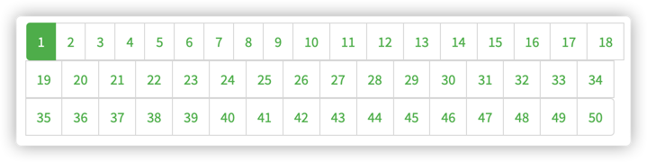

# conduit-nuxt

conduit基于nuxt.js实现版本

## 步骤

- feat: 安装nuxt, 配置scripts
- feat: 1-项目初始化样式转为国内CDN 或 本土化
- feat: 2-项目初始化app.html挪到根目录
- feat: 3-项目初始化nuxtjs 默认路由配置不满足需求, 配置 nuxt.config.js 覆盖默认路由配置
- feat: 4-项目初始化home 页面导入
- feat: 5-项目初始化-登录/注册页面导入和设置完成
- feat: 6-项目初始化-导入其他剩余模板
- feat: 7-项目初始化-处理顶部nav中的导航链接
- feat: 8-项目初始化-处理导航链接高亮
- feat: 9-项目初始化-封装请求模块
- feat: 10-登录注册-实现基本登录功能
- feat: 11-登录注册-封装请求方法
- feat: 12-登录注册-表单验证 ( 浏览器原生方式 )
- feat: 13-登录注册-错误处理
- feat: 14-登录注册-用户注册
- feat: 15-登录注册-同构应用的登录状态处理过程 ( 无 coding, JWT 整体认知 )
- feat: 16-登录注册-登录状态存储到容器中
- feat: 17-登录注册-登录状态持久化
- feat: 18-登录注册 处理导航栏链接根据登录状态展示
- feat: 19-登录注册 处理页面URL直接访问权限
- feat: 20-首页-业务介绍 (无 coding)
- feat: 21-首页-展示公共文章列表
- feat: 22-首页-列表分页-分页参数的使用
- feat: 23-首页-列表分页-页码处理
- feat: 24-首页-展示文章标签列表
- feat: 25-首页-优化并行异步任务
- feat: 26-首页-处理标签列表链接和数据
- feat: 27-首页-处理导航栏业务介绍
- feat: 28-首页-处理导航栏-展示状态处理
- feat: 29-首页-处理导航栏-标签高亮及链接
- feat: 30-首页-处理导航栏-展示用户关注的文章列表
- feat: 31-首页-统一设置用户 Token
- feat: 32-首页-文章发布时间格式化处理
- feat: 33-首页-文章点赞
- feat: 34-文章详情-业务介绍

### 15-同构应用的登录状态处理过程

> 讲解, 无 coding

#### SPA 应用 (CSR)

- 登录状态存储在 store 或 localStorage 中

#### 同构应用

- 同构应用处理起来不能和 SPA 一样 ??
- 应为无论在客户端渲染 还是 服务端渲染时, 都应该能拿到登录状态
- nuxt [官网解决方案: JWT](https://www.nuxtjs.cn/examples/auth-external-jwt)

### 16 | 17 JWT 方案实践
略

### 18-登录注册 处理导航栏链接根据登录状态展示
- 登录状态: 展示 New Post | Settings | user info
- 未登录转态: 展示 sign in | sign up

问题: 
- 如果未登录状态直接 url 访问: http://localhost:3000/editor, 没有处理
- 方案: 路由拦截 (同构应用略有不同)

### 19-登录注册 处理页面URL直接访问权限
- Chrome Dev Tool 工具中 Application --> 清除 Cookie 中的 user
- 直接访问: http://localhost:3000/editor  验证是否拦截
- 方案: **路由中间件** 参考 [学习指南 -> 路由 -> 中间件](https://www.nuxtjs.cn/guide/routing)
- 特点: 既能处理服务端的路由拦截, 也能处理客户端的路由拦截
- 案例: [codeSandbox](https://codesandbox.io/s/github/nuxt/nuxt.js/tree/dev/examples/auth-jwt?from-embed=&file=/middleware/authenticated.js)
- 步骤
  - 创建 middleware/authenticated.js
  - 编写 authenticated 中间件, 是一个函数
  - 在 nuxt.config.js 或 页面中 使用 中间件
  - 本案例中: edit页面, settings页面, profile页面需要使用 authenticated 中间件
  - Unknown middleware authenticated 时, 重启 npm run dev 试试
- 思考
  - 中间件中 redirect 的原理?

### 21-首页-展示公共文章列表
[接口 GET /api/articles](https://github.com/gothinkster/realworld/tree/master/api#list-articles)

### 22-首页-列表分页-分页参数的使用

接口 /api/articles
- ?limit=20
- ?offset=0 数据偏移量, 和页面有关

```js
// 计算公式
// limit 每页数据条数
// offset 数据偏移量, 0 开始
// articlesCount 总数据量

// page 第几页, 1 开始
offset = (page - 1) * limit

// pageCounts 总页数
pageCounts = Math.ceil(articlesCount / limit) 

```

### 23-首页-列表分页-页码处理


[参考示例样式](https://demo.realworld.io/#/)


默认情况下，query 的改变不会调用asyncData方法。如果要监听这个行为，例如，在构建分页组件时，您可以设置应通过页面组件的[watchQuery属性](https://www.nuxtjs.cn/api/pages-watchquery)监听参数

### 24-首页-展示文章标签列表


[GET /api/tags](https://github.com/gothinkster/realworld/tree/master/api#get-tags)

### feat: 27-首页-处理导航栏业务介绍


1. 未登录时只显示 'Global Feed', 需要区分登录态
2. 'Your Feed', 登录时展示
3. 标签导航点击标签时出现, 
  
### feat: 31-首页-统一设置用户 Token
鉴权写在 axios 的 拦截器 [interceptors](https://github.com/axios/axios#interceptors) 中

[参考 博文](https://juejin.cn/post/6844904022353117192)

#### 基本用法
```js
// Add a request interceptor
axios.interceptors.request.use(function (config) {
    // Do something before request is sent
    return config;
  }, function (error) {
    // Do something with request error
    return Promise.reject(error);
  });

// Add a response interceptor
axios.interceptors.response.use(function (response) {
    // Any status code that lie within the range of 2xx cause this function to trigger
    // Do something with response data
    return response;
  }, function (error) {
    // Any status codes that falls outside the range of 2xx cause this function to trigger
    // Do something with response error
    return Promise.reject(error);
  });
```

#### 如何在拦截器中获取用户 token ?

```js
instance.interceptors.request.use(function(config) {
   
   config.headers.Authorization = `Token ${token ???}` // <-- 如何获取

    return config
}, function(error) {
    // 请求未发出就失败的情况
    return Promise.reject(error)
})
```
参考 [nuxt 插件](https://www.nuxtjs.cn/guide/plugins)


### feat: 32-首页-文章发布时间格式化处理
- [dayjs](https://github.com/iamkun/dayjs/blob/dev/docs/zh-cn/README.zh-CN.md) 
- 在全局过滤器中实现
- vue 的过滤器 ?
- nuxt 的过滤器 ?
  - 需要 nuxt.config.js 中注册插件
```js
// 期望格式处理为: August 1, 2021
dayjs('2019-01-25').format('MMM D, YYYY')
```

### feat: 33-首页-文章点赞
- POST [/api/articles/:slug/favorite](https://github.com/gothinkster/realworld/tree/master/api#favorite-article)
- DELETE [/api/articles/:slug/favorite](https://github.com/gothinkster/realworld/tree/master/api#unfavorite-article)

注意: 弱网情况下连续点赞/取消点赞需要标识处理, 防止多次无效请求

### feat: 34-文章详情-业务介绍
- 文章详情
- 作者详情, 关注, 点赞
- 评论

### feat: 35-文章详情-展示基本信息
- `pages/article/index.vue`
- [GET /api/articles/:slug](https://github.com/gothinkster/realworld/tree/master/api#get-article)